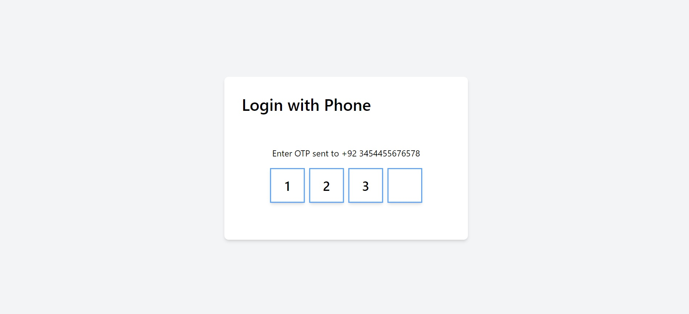

# OTP Login Form

## Description
The OTP Login Form is a React component that allows users to authenticate using a one-time password (OTP) sent to their phone number. It consists of a form where users can input their phone number along with their country code, and upon submission, an OTP is sent to their phone for verification. Once the OTP is entered correctly, the user is logged in successfully.

## Features
- Input field for entering phone number
- Dropdown list for selecting country code
- OTP input field for entering the received OTP
- Ability to resend OTP
- Error handling for invalid phone numbers and incorrect OTPs
- Responsive design for seamless usage across devices

## Components
### OTPLoginForm Component
This component contains the main logic for the OTP login process. It manages the state of the phone number, selected country code, OTP input, and login status. The component renders different UI elements based on the current state, such as the phone number input form or the OTP input form.

### OTPInput Component
This component is responsible for rendering the OTP input field. It allows users to enter the received OTP for verification.

### countryCodes
This file contains an array of country codes used in the dropdown list for selecting the country code.

## Technologies
- React: JavaScript library for building user interfaces
- JSX: Syntax extension for JavaScript used with React
- Tailwind CSS: Utility-first CSS framework for styling components
- HTML: Markup language for creating web pages
- JavaScript: Programming language for adding interactivity to web pages

## Demo Images
step 1. 
step 2. 
step 3. 
step 4. 

## Usage
To use the OTP Login Form component in your project:
1. Import the OTPLoginForm component into your React application.
2. Render the OTPLoginForm component within your desired parent component.
3. Customize the component's appearance and functionality as needed.
4. Handle the OTP verification process on the server-side.

## License
This project is licensed under the MIT License - see the [LICENSE](LICENSE) file for details.
